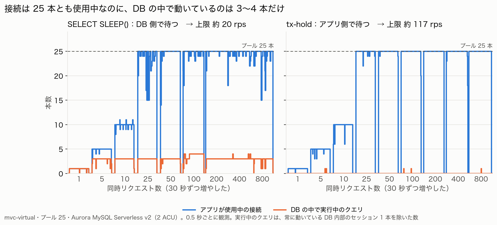
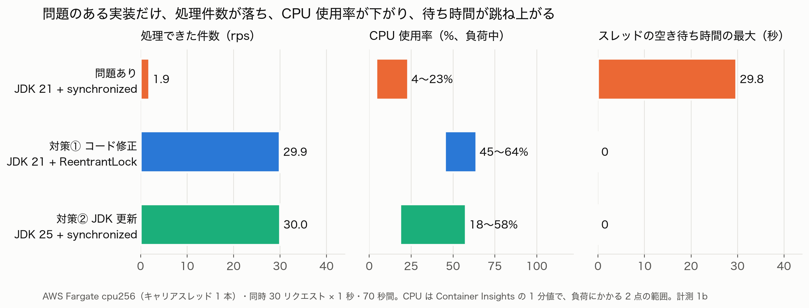
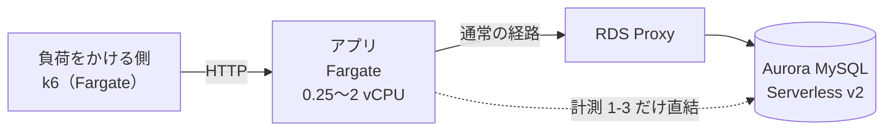
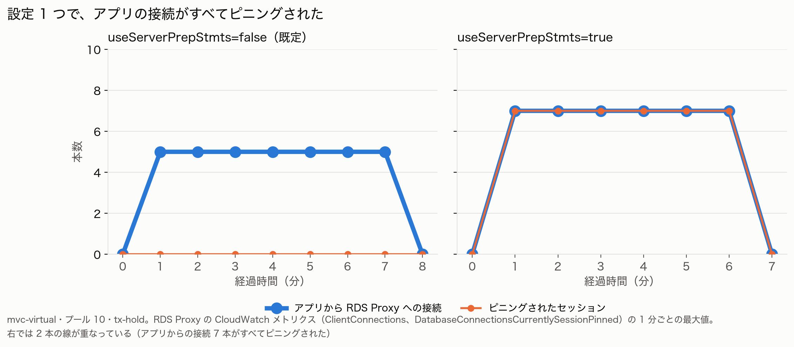

# concurrency-model-rds-proxy-fargate

Java の 3 つの並行処理モデル（従来のスレッド・仮想スレッド・WebFlux）を AWS 上で動かし、
**スループットの上限を実際に決めているのは何か**を計測した検証です。

構成は Spring Boot 4.1 / Java 25（一部 21）/ Aurora MySQL Serverless v2 / RDS Proxy / ECS Fargate です。
計測はすべて AWS 東京リージョンで行いました。

## 結論

### 仮説 1：スループットの上限はコネクションプールで決まる

**おおむね正しい。ただし、DB の中にも別の上限がありました。**

- 接続を保持してアプリ側で待つ処理（`tx-hold`）では、上限は `プールの本数 ÷ 1 回の保持時間` のとおりになりました。
  3 つのモデルで差はなく、タスクの CPU を 8 倍にしても変わりません。
- 一方、DB 側で待つ処理（`SELECT SLEEP()`）では、プールを 5 本から 25 本に増やしても上限は約 20 rps のままでした。
  接続は 25 本とも使用中なのに、**Aurora の中で同時に実行されていたのは 3〜4 本だけ**でした。
  Aurora Serverless v2 でも、通常のインスタンス（db.t4g.medium）でも同じです。

| 上限（rps） | プール 5 | プール 10 | プール 25 |
|---|---|---|---|
| 計算値（プール ÷ 0.215 秒） | 23 | 47 | 116 |
| `tx-hold`（3 モデル） | 23〜27 | 45〜51 | 114〜121 |
| `SELECT SLEEP()`（3 モデル） | 10〜20 | 約 20 | 約 20 |



スループットの上限は、コネクションプールだけで決まるとは限りません。今回は DB の中にも制限がありましたが、どこにいくつ制限があるかは環境によって違います（手元の MySQL では、DB の中の制限は見られませんでした）。
**自分の環境で計測し、どこが上限になっているかを確かめてから設計する**必要があります。

**上限を超えたリクエストの待ち場所も、モデルによって変わりました。**
従来のスレッドでは、Tomcat のスレッド 200 本が同時実行数の上限になり、上限を超えたリクエストはアプリに入る前に待たされます。
仮想スレッドや WebFlux にはこの上限がなく、すべてのリクエストがアプリに入ってコネクションプールの空きを待つので、接続待ちのタイムアウト（エラー）が従来のスレッドの 2〜4 倍に増えました。
処理しきれないリクエストを待たせたり拒否したりする場所（バックプレッシャーがかかる場所）が、アプリの入り口から奥に移ったためです。
対策の 1 つとして、同時実行数を制限し、上限を超えたリクエストは長く待たせずに 503 を返す方法があります（`/api/bounded`）。

### 仮説 2：数の限られたスレッドをブロックすると、アプリ全体が応答しなくなる。しかも CPU 使用率には表れない

**正しい。**

- 仮想スレッドを動かすキャリアスレッドや、WebFlux のイベントループは、数本しかありません（キャリアスレッドは CPU の数、イベントループは既定で最低 4 本）。
  これをブロックすると、無関係なリクエストまで処理されなくなりました。
- そのとき **CPU 使用率はむしろ下がるか、変わりませんでした。** スレッドは待っているだけで計算していないからです。
  処理できた件数が 42 倍違っても、CPU 使用率が同じだった組もあります。CPU を見ていても、この停止には気づけません。
- 対策は 2 つあり、どちらも効きました。コードを直す（`synchronized` → `ReentrantLock`）か、
  JDK を 24 以降に上げるかです。WebFlux の場合は JDK を上げても直らず、処理を別のスレッドに逃がす必要があります。



## 用語

| 用語 | 意味 |
|---|---|
| コネクションプール | DB への接続をあらかじめ作っておき、使い回す仕組み。本数に上限がある |
| 仮想スレッド | Java 21 で入った軽量なスレッド。大量に作れる。実際の処理は、少数の OS スレッド（**キャリアスレッド**。既定では CPU の数と同じ本数）の上で実行される |
| イベントループ | WebFlux（Reactor Netty）でリクエストを処理するスレッド。既定の本数は `max(4, CPU の数)` で、小さいタスクでも 4 本 |
| 仮想スレッドのピニング | 仮想スレッドが待っている間もキャリアスレッドを手放せない状態。JDK 21 では `synchronized` の中で待つと起きる。JDK 24 で解消（[JEP 491](https://openjdk.org/jeps/491)） |
| RDS Proxy | アプリと DB の間に入り、アプリ側の多数の接続を少ない DB 接続に束ねるサービス |
| RDS Proxy のセッションピニング | RDS Proxy が接続を束ねられなくなり、アプリの接続 1 本に DB の接続 1 本を固定する状態。仮想スレッドのピニングとは別物 |
| rps | 1 秒間に処理できたリクエストの数（requests per second） |
| バックプレッシャー | 処理しきれないリクエストを待たせたり拒否したりして、呼び出し元に負荷を下げるよう伝える仕組み |
| スレッドの空き待ち時間 | キャリアスレッド（またはイベントループ）に小さな仕事を投げてから、走り出すまでに待たされた時間。アプリの中で自分で測っている |

**同時実行数と並列実行数の違い**が、仮説 2 を読む鍵です。

- Tomcat の 200 本のスレッドは、**同時にいくつのリクエストを受け持つか**のための本数です。
  1 本が DB を待ってブロックされても、残りの 199 本で別のリクエストを受け持てます。ブロックされたスレッドは寝ているだけなので、CPU も使いません。
  ただし 200 本がすべて使用中になると、新しいリクエストは空きが出るまで待たされます。
  つまり 200 本は、コネクションプールと同じ「同時に受け持てる数の上限」です。
- キャリアスレッドやイベントループは、**同時にいくつのコードを実際に動かすか**のための本数で、CPU の数ほどしかありません（今回の 0.25 vCPU のタスクでは、キャリアスレッドが 1〜2 本、イベントループが 4 本）。
  こちらは 1 本ブロックされるだけで、他の処理がすべて止まります。

前者は「ブロックされる前提で多めに用意した本数」、後者は「ブロックされない前提で最小限に用意した本数」です。
後者をブロックしてしまうのが、仮説 2 の問題です。

## 比べた実装

| 条件 | 内容 | 役割 |
|---|---|---|
| `mvc-platform` | Spring MVC + 従来のスレッド（Tomcat のスレッド 200 本） | 3 モデル比較 |
| `mvc-virtual` | Spring MVC + 仮想スレッド（JDK 25） | 3 モデル比較。仮説 2 の対策②（JDK を上げる） |
| `webflux-r2dbc` | WebFlux + R2DBC（ノンブロッキング） | 3 モデル比較 |
| `mvc-virtual-jdk21` | `mvc-virtual` を JDK 21 で動かす | 仮説 2 の問題あり（`synchronized` でピニング） |
| `mvc-virtual-jdk21-lock` | 同じ処理を `ReentrantLock` で書く | 仮説 2 の対策①（コードを直す） |
| `webflux-blocking` | WebFlux のイベントループで JDBC を呼ぶ | 仮説 2 の問題あり（イベントループをブロック） |
| `webflux-blocking-isolated` | 同じ JDBC 呼び出しを `boundedElastic` に逃がす | 仮説 2 の対策 |

主なエンドポイントです。保持時間は `ms` で指定します（既定 200 ms）。

| エンドポイント | 内容 |
|---|---|
| `/api/tx-hold` | トランザクションを開始し、軽いクエリを 1 本投げてから**アプリ側で**待ち、コミットする。接続だけを保持する |
| `/api/db` | `SELECT SLEEP()` で **DB 側で**待つ。接続に加えて DB の中の処理も占有する |
| `/api/nodb` | DB を使わずに待つ。比較の基準 |
| `/api/bounded` | 同時実行数を制限し、空きがなければ最大 0.2 秒待って、それでも空かなければ 503 を返す（仮説 1 の対策） |
| `/api/pinned` / `/api/pinned-lock` | `synchronized` / `ReentrantLock` の中で待つ（仮説 2 の問題あり / 対策①） |
| `/api/blocking` / `/api/blocking-isolated` | イベントループ上 / `boundedElastic` 上で JDBC を呼ぶ（仮説 2 の問題あり / 対策） |
| `/api/diagnostics` | CPU 数、プールの設定、スレッドの空き待ち時間などを返す。計測条件の確認に使う |

## 計測の構成



- ロードバランサは置いていません。ロードバランサ側の待ち行列が、測りたい差に混ざるのを避けるためです。
- 負荷をかける側（k6）はアプリとは別のタスクで動かしています。同じマシンだと CPU を奪い合うからです。
- 同時数を 1 → 5 → 10 → 25 → 50 → 100 → 200 → 400 → 800 と、30 秒ずつ段階的に上げました。

構成の詳細・セキュリティ・デプロイ手順は [docs/aws.md](docs/aws.md) にあります。

## 計測と結果

計測は仮説ごとにまとめています。各計測の表はすべて [results/](results/README.md) にあります。

| 仮説 | # | 何を確かめたか | 結果 |
|---|---|---|---|
| 1 | 1-1 | 上限は `プール ÷ 保持時間` で決まるか。3 モデルで揃うか。上限を超えた分はどこで待つか | `tx-hold` では決まり、揃った。`SELECT SLEEP()` では DB 側が先に上限になった。仮想スレッドや WebFlux では待ち場所がプールに移り、タイムアウトが増えた |
| 1 | 1-2 | DB の中で何本の処理が同時に進んでいるか | 接続 25 本に対し 3〜4 本だけ |
| 1 | 1-3 | RDS Proxy を外すと上限は変わるか | 変わらない。Proxy を通すと応答が約 10 ms 延びるだけ |
| 1 | 1-4 | 設定 1 つで RDS Proxy のセッションピニングが起きるか | 起きた。アプリ 1 台では上限に影響しなかった |
| 1 | 1-5 | タスクの CPU を増やすと上限は変わるか | DB を使わない処理は伸びた。プールで決まる上限は変わらなかった |
| 2 | 2-1 | 数の限られたスレッドをブロックすると、無関係なリクエストも止まるか | 止まった。処理できた件数は 0.1% 以下に落ちた |
| 2 | 2-2 | 対策すると直るか。そのとき CPU はどう見えるか | 直った。問題ありの側のほうが CPU 使用率が低かった |

### 仮説 1 の計測

#### 計測 1-1：上限はコネクションプールで決まるか

**何を**：プールを 5 / 10 / 25 本に変え、3 つのモデルで上限の rps を比べます（cpu1024、Aurora は 2 ACU に固定）。

**何のために**：上限が `プールの本数 ÷ 保持時間` のとおりに伸び、モデルによらず揃うなら、上限を決めているのはプールだと言えます。

**結果**：最初は `SELECT SLEEP(0.2)` で測りました。すると、プールを増やしても上限は約 20 rps で止まりました。
原因を切り分けるために、次のことを確かめました。

1. アプリと負荷をかける側は原因ではない。DB を使わない処理は、同じ 1 vCPU で約 3,300〜3,900 rps まで伸びる（計測 1-5）
2. RDS Proxy も原因ではない。直結しても同じ（計測 1-3 の 1 回目）
3. Aurora の容量を 2 → 8 ACU に上げると、上限は 30〜35 rps に上がる
4. アプリに観測用のコードを入れ、DB の中で実行中の `SLEEP` を調べた（計測 1-2）
5. 通常インスタンス（db.t4g.medium）でも同じだった。Serverless 特有ではない

Aurora MySQL のスレッド処理方式（`thread_handling`）は `thread-pools` で、変更できません。
AWS も「Aurora MySQL は内部に接続プールとスレッドの多重化を持つ」と説明しています
（[AWS Database Blog](https://aws.amazon.com/blogs/database/planning-and-optimizing-amazon-aurora-with-mysql-compatibility-for-consolidated-workloads/)）。
ただし、同時に処理される数が容量に応じて何本になるかは公開されていません。3〜4 本という数字は、今回の実測だけが根拠です。

そこで、DB の中の処理を使わずに接続だけを保持する `tx-hold` で測り直しました。

| 上限（rps、同時数がプールの本数以上の段） | プール 5 | プール 10 | プール 25 |
|---|---|---|---|
| `mvc-platform` | 24〜27 | 47〜51 | 114〜121 |
| `mvc-virtual` | 23〜26 | 45〜49 | 117〜119 |
| `webflux-r2dbc` | 24〜27 | 45〜48 | 115〜120 |

1 回の保持時間は、トランザクションの開始・コミットを含めて約 215 ms でした。
これで割ると 23 / 47 / 116 rps で、実測とほぼ一致します。DB の中で実行中の処理は 0 本のままでした。

**上限を超えたリクエストはどこで待たされるか。** 上限（プール 10 本で約 47 rps）で、同時リクエスト数を段階的に増やしていったうちの、最後の段階（同時 800 リクエスト、30 秒間）を比べます（`tx-hold`）。

| モデル | 待たされる場所 | エラー | p50 | max |
|---|---|---|---|---|
| `mvc-platform` | Tomcat の 200 本が埋まり、その手前（受け付け）で待つ | 815 | 11.7 秒 | 15.2 秒 |
| `mvc-virtual` | すべてのリクエストがアプリに入り、コネクションプールの前で待つ。5 秒で接続待ちがタイムアウトする | **3,606** | 5.5 秒 | 6.6 秒 |
| `webflux-r2dbc` | すべてのリクエストがアプリに入り、R2DBC のプールの前で待つ | 1,664 | 10.0 秒 | 11.4 秒 |

従来のスレッドでは、Tomcat のスレッド 200 本が同時実行数の上限になっています。仮想スレッドや WebFlux にはこの上限がなく、
**待つ場所がアプリの奥（コネクションプール）に移り**、接続待ちのタイムアウトが、仮想スレッドで約 4 倍、WebFlux で約 2 倍に増えました。

対策の 1 つとして、同時実行数を制限し、上限を超えたリクエストは長く待たせずに 503 を返す方法があります。
`/api/bounded`（同時実行数 10。空きがなければ最大 0.2 秒待ち、それでも空かなければ 503）では、3 モデルとも同時 800 でエラーは 0 件、p50 は 0.2〜0.8 秒でした。
短い時間だけ待つのは、リクエストが一時的に集中したときに、すぐに空く分まで 503 にしないためです。
この計測は `SELECT SLEEP()` を使っていた時期に測ったもので、上限は約 20 rps です。`tx-hold` では測っていません。

返すステータスコードも違います。接続待ちのタイムアウトは例外になり、Spring の既定では 500 を返します（ステータスコードごとには記録していないので「おそらく 500」）。
500 は予期しない失敗に見えますが、503 は「一時的に処理できない」という意図した応答で、呼び出し元は時間をおいて再試行できます。
429 Too Many Requests は「その呼び出し元が送りすぎている」という意味なので、サーバ全体が混雑しているときは 503 のほうが適切です。

自作しなくても、同時実行数を制限する仕組みはあります。上限を超えたときの振る舞いが違います（どちらも公式ドキュメントで確かめたもので、今回は試していません）。

| 仕組み | 上限を超えたとき |
|---|---|
| Spring Framework 7 の [`@ConcurrencyLimit`](https://docs.spring.io/spring-framework/reference/core/resilience.html) | 空くまで待たせる（拒否はしない）。スレッド数に上限のない仮想スレッドで特に有用とされている |
| [Resilience4j の Bulkhead](https://resilience4j.readme.io/docs/bulkhead) | 待つ最大時間（`maxWaitDuration`）を過ぎたら例外になる。例外を 503 に変換すれば、今回の対策と同じ動きになる。WebFlux でも使える |
| 自作（今回の `Semaphore` / `AsyncSemaphore`） | 最大 0.2 秒待って、空かなければ 503 を返す |

接続待ちのタイムアウトが効くのは、**待っている側**だけです。接続を**保持している側**から接続を取り上げるわけではありません。
接続を保持したまま返さない処理があれば、プールは埋まったままになります。その対策は、保持する側に時間の上限を付けること
（トランザクションやクエリのタイムアウト、トランザクションの中で呼ぶ外部 API のタイムアウト）です。

#### 計測 1-2：DB の中で何本の処理が同時に進んでいるか

**何を**：アプリのプールとは別に観測用の接続を 1 本張り、0.5 秒ごとに「アプリが使用中の接続」と「DB の中で実行中の `SLEEP`」を数えます（`mvc-virtual`・プール 25・`SELECT SLEEP()`）。

**何のために**：接続が足りているのに上限で止まるなら、DB の中で順番待ちしているはずです。それを直接確かめます。

**結果**：使用中の接続が 5 本でも 25 本でも、DB の中で実行中の `SLEEP` は 3〜4 本で頭打ちでした（Serverless v2 の 2 ACU）。
通常インスタンスの db.t4g.medium でも最大 3 本でした。`tx-hold` では、DB の中で実行中の処理は 0 本のままでした（結論の図）。
手元の MySQL（接続ごとにスレッドを持つ方式）では、使用中 8 本に対して実行中も 8 本で一致しました。

#### 計測 1-3：RDS Proxy を外すと上限は変わるか

**何を**：`mvc-virtual`・プール 10・`tx-hold` で、RDS Proxy 経由と Aurora 直結を比べます。

| | 上限（同時 25） | 1 回の応答時間 p50（同時 10） |
|---|---|---|
| RDS Proxy 経由 | 46.7 rps | 219.9 ms |
| Aurora 直結 | 48.5 rps | 209.4 ms |

**結果**：上限は変わりません。アプリの接続が 10 本なら、中継があってもなくても同時に処理できるのは 10 本だからです。
Proxy を通すと 1 回あたり約 10 ms 延び、そのぶん上限が少し下がります。
RDS Proxy は上限を上げる仕組みではなく、DB 側の接続を束ねる仕組みです。

#### 計測 1-4：RDS Proxy のセッションピニング

**何を**：計測 1-3 と同じ条件で、JDBC の設定 `useServerPrepStmts=true`（サーバ側プリペアドステートメント）を有効にします。

**何のために**：この設定を入れると、RDS Proxy は接続を束ねられなくなります（セッションピニング）。
設定 1 つで、Proxy を置いた意味が失われることを確かめます。

**結果**：ピニングされたセッションは 0 → 最大 7 本に増えました（1 分ごとの値）。上限と応答時間は変わりませんでした（46.9 rps、p50 217.6 ms）。



RDS Proxy から見たアプリの接続 7 本が、すべてピニングされています（右の 2 本の線が重なっている）。
なお、CloudWatch に出るアプリからの接続数は 5〜7 本で、プールの 10 本より少なく出ています。理由は確かめていません。

アプリ 1 台・接続 10 本なら、束ねられなくても DB 側の接続は 10 本で足りるからです。
困るのは、アプリの台数が増えて、DB 側の接続の上限（今回は 200 本）に届いたときです。これは実測していません。

RDS Proxy が接続を束ねられなくなる条件は、[Avoiding pinning an RDS Proxy（AWS ドキュメント）](https://docs.aws.amazon.com/AmazonRDS/latest/UserGuide/rds-proxy-pinning.html)にまとまっています。
MySQL ではプリペアドステートメントのほか、セッション変数の設定や一時テーブルの作成でも起きます。

#### 計測 1-5：タスクの CPU を増やすと上限は変わるか

**何を**：タスクの CPU を 0.25 / 0.5 / 1 / 2 vCPU に変え、DB を使わない処理（`nodb`）と `tx-hold`（プール 10）の上限を比べます。

| 上限（rps） | 0.25 vCPU | 0.5 vCPU | 1 vCPU | 2 vCPU |
|---|---|---|---|---|
| `mvc-virtual` / `nodb` | 1,816 | 2,821 | 3,335 | 3,966 |
| `webflux-r2dbc` / `nodb` | 2,489 | 2,865 | 3,912 | 3,944 |
| `mvc-virtual` / `tx-hold` | 46〜49 | 48〜50 | 48〜50 | 47〜49 |
| `webflux-r2dbc` / `tx-hold` | 47〜50 | 48〜50 | 46〜48 | 46〜49 |

**結果**：DB を使わない処理は CPU に合わせて伸びました（1 vCPU 以上がおよそ 4,000 で揃うのは、負荷をかける側の上限です）。
なお、JVM が認識した CPU 数（`availableProcessors`）は、0.25〜1 vCPU では 1 または 2、2 vCPU では 2 で、タスクサイズだけでは決まりませんでした。
伸びたのは認識した CPU 数ではなく、使える CPU 時間が増えたためです。
`tx-hold` の上限はどの大きさでも約 47 rps で、**CPU を増やしてもプールで決まる上限は動きません。**

### 仮説 2 の計測

#### 計測 2-1：数の限られたスレッドをブロックすると、無関係なリクエストも止まるか

**何を**：cpu256（0.25 vCPU）のタスクで、キャリアスレッドやイベントループをブロックする処理に 30 同時で負荷をかけます。
同時に、DB を使わない軽いリクエストを別に送り続け、それが処理されるかを見ます。

**何のために**：軽いリクエストは DB を使わないので、遅くなったとすれば原因はスレッドが空かないことだけです。

**結果**：

| 条件 | 軽いリクエストの処理件数（負荷なし → 負荷中） | 維持率 |
|---|---|---|
| `webflux-blocking`（ブロックする） | 66.9 → 0.08 件/秒 | **0.12%** |
| `webflux-r2dbc`（ブロックしない） | 62.2 → 64.7 件/秒 | 104% |
| `mvc-virtual-jdk21`（ブロックする） | 74.4 → 0.04 件/秒 | **0.05%** |
| `mvc-virtual`（JDK 25、ブロックしない） | 69.5 → 74.7 件/秒 | 107% |

同じ時間帯の CPU 使用率（0.25 vCPU に対する割合）も並べます。

| 条件 | 処理できた件数（70 秒、負荷と観測の合計） | CPU 使用率 |
|---|---|---|
| `webflux-blocking`（ブロックする） | — | 13% |
| `webflux-r2dbc`（ブロックしない） | — | 71% |
| `mvc-virtual-jdk21`（ブロックする） | 138 件 | 18% |
| `mvc-virtual`（JDK 25、ブロックしない） | 5,835 件 | 18% |

WebFlux の組では、止まっている側のほうが CPU 使用率が低くなりました。仮想スレッドの組では、処理できた件数が 42 倍違うのに CPU 使用率は同じでした。
どちらの場合も、CPU 使用率だけでは止まっているかどうかを見分けられません。

#### 計測 2-2：対策すると直るか

**何を**：計測 2-1 と同じ負荷で、問題ありと対策後を同じイメージで測り、処理できた件数・CPU 使用率・スレッドの空き待ち時間・ピニングの件数を比べます。

**何のために**：対策が効くことと、そのとき CPU 使用率がどう見えるかを確かめます。

**結果**：

| 条件 | 処理できた件数（70 秒） | CPU 使用率（負荷中） | スレッドの空き待ち時間の最大 | ピニング |
|---|---|---|---|---|
| `mvc-virtual-jdk21`（問題あり） | 130 件（約 2 rps） | **4〜23%** | 29.8 秒 | 130 件 |
| `mvc-virtual-jdk21-lock`（対策①） | 2,096 件（約 30 rps） | 45〜64% | 0 秒 | 0 件 |
| `mvc-virtual`（対策②、JDK 25） | 2,100 件（約 30 rps） | 18〜58% | 0 秒 | 0 件 |
| `webflux-blocking`（問題あり） | 302 件 | **19〜33%** | 7.0 秒 | — |
| `webflux-blocking-isolated`（対策） | 710 件（約 10 rps） | 40〜46% | 0.08 秒 | — |

- ピニングの件数は、Java の記録機能（JFR）が出すイベント `jdk.VirtualThreadPinned` を、アプリの中で購読して数えました（20 ms 以上のものだけ）。ファイルには書き出していません。仕組みは [docs/design.md](docs/design.md#jfr-の-2-つの使い方) にあります。
- 問題ありの側では、処理できた件数とピニングの件数が 130 件で一致しました。1 件ごとに、1 本しかないキャリアスレッドを約 1 秒占有していたということです。待ち時間が伸びたことだけでは「詰まった」までしか言えませんが、この件数で原因がピニングだと確定できます。
- CPU 使用率は Container Insights の 1 分ごとの値で、負荷にかかる 2 点の範囲です。
- JVM が認識した CPU 数は、同じ 0.25 vCPU でも条件によって 1 または 2 でした。問題ありの `mvc-virtual-jdk21` は 1（キャリアスレッド 1 本）、対策①の `-lock` は 2 で、条件が揃っていません。
  ただし、ピニングしたままならキャリアスレッドが 2 本でも上限は約 2 rps です。対策①の約 30 rps は、本数の違いでは説明できません。
- WebFlux のイベントループは、どの条件でも 4 本でした。`webflux-blocking` の 302 件（約 4 rps）は、4 本 × 1 秒の保持でちょうど説明できます。
- 再現性：`webflux-blocking` を 3 日あけて別のイメージで測り直したところ、処理できた件数は 302 件 → 302 件で同じでした。
- `webflux-blocking-isolated` が 10 rps で止まるのは、逃がし先の `boundedElastic` の本数が既定で `CPU 数 × 10`（ここでは 10 本）だからです。
  ブロックの影響は消えますが、逃がし先の本数という別の上限は残ります。

#### 対策のコード

仮想スレッドのピニングは、`synchronized` の中で待つと起きます（JDK 21〜23）。対策は 2 つあります。

**対策① `synchronized` を `ReentrantLock` に置き換える**（[`PinnedWorkload.java`](mvc/src/main/java/com/ryotashi29/cnj/runtime/concurrency/mvc/service/PinnedWorkload.java)）

```java
// 問題あり：待っている間もキャリアスレッドを手放せない
synchronized (monitor) {
    sleep(holdMillis);
}

// 対策①：ReentrantLock は待つときにキャリアスレッドを手放す
lock.lock();
try {
    sleep(holdMillis);
} finally {
    lock.unlock();
}
```

**対策② JDK を 24 以降に上げる。** コードはそのままで、`synchronized` の中で待ってもピニングしなくなります（[JEP 491](https://openjdk.org/jeps/491)）。
ただし、JNI などのネイティブコードを呼んでいる最中は、JDK 24 以降でもピニングが残ります。

**WebFlux の対策：ブロックする処理を `boundedElastic` に逃がす**（[`EventLoopBlockingWorkload.java`](webflux/src/main/java/com/ryotashi29/cnj/runtime/concurrency/webflux/service/EventLoopBlockingWorkload.java)）

```java
// 問題あり：JDBC の呼び出しがイベントループの上で動き、イベントループをブロックする
Mono.fromCallable(() -> jdbcTemplate.queryForObject(...));

// 対策：ブロックしてよい別のスレッドで動かす
Mono.fromCallable(() -> jdbcTemplate.queryForObject(...))
        .subscribeOn(Schedulers.boundedElastic());
```

WebFlux は JDK を上げても直りません。どのスレッドで動かすかを決めるのはコードの書き方なので、書く人が移すしかありません。

参考になる公開資料です。

- [Virtual Threads（Oracle Java 21 ドキュメント）](https://docs.oracle.com/en/java/javase/21/core/virtual-threads.html)：ピニングの説明と、`synchronized` を `ReentrantLock` に置き換える方法（「Avoid Lengthy and Frequent Pinning」の節）
- [JEP 491: Synchronize Virtual Threads without Pinning](https://openjdk.org/jeps/491)：JDK 24 で `synchronized` によるピニングが解消された変更
- [How Do I Wrap a Synchronous, Blocking Call?（Reactor リファレンス）](https://projectreactor.io/docs/core/release/reference/faq.html#faq.wrap-blocking)：WebFlux / Reactor でブロックする処理を `boundedElastic` に逃がす方法

## 確かめていないこと

実測ではなく推測にとどまっているものです。

- Aurora の中で同時に処理される数が 3〜4 本になる仕組み。スレッドプールだと考えていますが、公開情報では確かめられませんでした
- RDS Proxy のセッションピニングで、アプリの台数が増えたときに DB の接続が足りなくなること
- JDK 25 でも残るピニング（JNI などのネイティブコードを呼んでいる最中）
- ロードバランサのヘルスチェックが失敗し、残ったタスクに負荷が集中する連鎖（ロードバランサを置いていないため）
- `mvc-virtual-jdk21-lock` で起動直後だけピニングが 2 件出た理由（負荷中は 0 件）
- `mvc-virtual` のスレッドの空き待ち時間が、負荷が極端な段で 250 ms 刻みの値になる理由
- 同じタスクサイズでも、JVM が認識する CPU 数が 1 になったり 2 になったりする理由
- 負荷中のメモリ使用量（RSS のピーク）の差の理由。`mvc-platform` 約 595 MB、`mvc-virtual` 約 670 MB、`webflux-r2dbc` 約 568 MB（cpu1024、`tx-hold`）で、繰り返しても同じ順番でした。仮想スレッドが待っている間の状態をヒープに持つためと考えていますが、ピーク時のヒープ使用量は記録していません
- 従来のスレッドで、コネクションプールが埋まったときに Tomcat の 200 本も接続待ちで埋まり、DB を使わないリクエストまで止まるか

## 手元で動かす

Docker・JDK 21 と 25・[k6](https://k6.io/) が必要です。

```bash
docker compose up -d                                  # MySQL（ポート 3307）
JAVA_HOME=$(/usr/libexec/java_home -v 21) ./gradlew build
./gradlew :mvc:bootRun                                # または :webflux:bootRun（どちらも 8080）

curl 'localhost:8080/api/tx-hold?ms=200'
curl localhost:8080/api/diagnostics
```

- 手元では CPU が多いため、仮説 2 の現象（スレッドのブロック）は再現しにくいです。確かめられるのは計測の仕組みが動くところまでです。
- 条件を一巡する `./k6/sweep.sh` や、ブロックの影響を見る `./k6/crosstalk.sh` もあります。使い方は [docs/design.md](docs/design.md) にあります。
- AWS での計測手順は [docs/aws.md](docs/aws.md) にあります。

## ファイル構成

| パス | 中身 |
|---|---|
| `mvc/` | Spring MVC 版のアプリ（MyBatis + HikariCP） |
| `webflux/` | WebFlux 版のアプリ（R2DBC とブロッキング JDBC の両方） |
| `common/` | 両方が使う設定と、観測用のコード（スレッドの空き待ち時間、ピニングの件数、DB の中の処理数） |
| `k6/` | 負荷のシナリオ。手元と AWS で同じものを使う |
| `cdk/` | AWS の計測環境（CDK）と計測スクリプト `cdk/scripts/measure-aws.sh` |
| `results/` | 計測結果の表 |
| `docs/` | 詳しい設計（[design.md](docs/design.md)）、AWS の構成と手順（[aws.md](docs/aws.md)）、図 |
