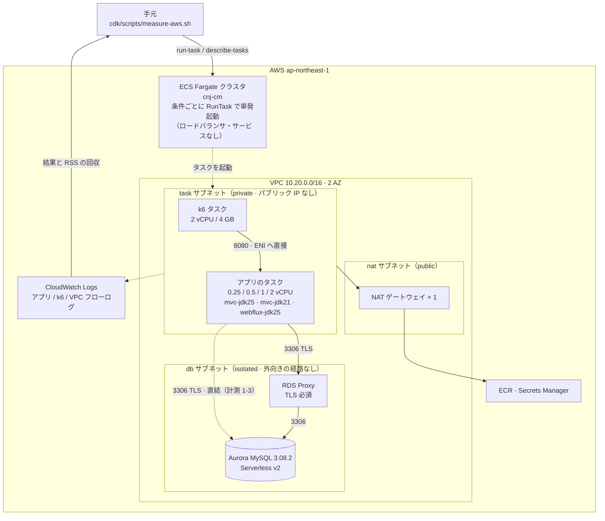

# AWS での計測環境と手順

[README](../README.md) の結果を測った環境の詳細です。構成・設計判断・セキュリティ・デプロイ・計測の流し方・注意点をまとめています。

## 構成



手元からアプリの 8080 へ届く経路はわざと作っていません。8080 を開けているのは k6 のタスクだけで、
疎通確認も VPC 内のタスクから行います。

### 計測のための設計判断

| 判断 | 理由 |
|---|---|
| **ロードバランサを置かない** | ロードバランサ側の待ち行列と接続の多重化が、測りたい差に混ざる。k6 のタスクからアプリのタスクへ直接送る |
| **ECS サービスにしない**（`RunTask`） | 条件ごとにサービスのデプロイを挟むと、1 条件あたり数分増える。条件は環境変数の上書きで渡す |
| **タスクサイズごとに別のタスク定義** | タスクサイズは実行時に上書きできない。計測 1-5 の変数なので 4 段ぶん用意する |
| **負荷をかける側を別のタスクにする** | 手元では負荷生成と計測対象が同じ CPU を奪い合っていた。それを構成で避ける |
| **タスクは private サブネット + NAT** | パブリック IP を付ければ NAT は要らないが、セキュリティチェックが最初に指摘する項目になる。`-c publicTasks=true` で NAT なしの構成にもできる |
| **ヒープと GC を固定**（`-Xms512m -Xmx512m -XX:+UseG1GC`） | 固定しないと、タスクサイズを変えた結果にヒープや GC の違いが混ざる（JVM は 2 CPU 未満だと Serial GC を選ぶ）。CPU 数（`ActiveProcessorCount`）は変数なので固定しない |
| **Graviton（ARM64）** | 手元が arm64 なので、イメージのビルドにエミュレーションが要らない |
| **イメージの中でソースから jar を作る** | 手元に残った古い jar を気づかずに計測する事故を防ぐ |
| **RSS はコンテナの中で `/proc` から採る** | Container Insights の `MemoryUtilized` と突き合わせられる |

イメージは 3 種類です（`mvc` × Corretto 25、`mvc` × Corretto 21、`webflux` × Corretto 25）。
WebFlux に JDK 21 版がないのは、イベントループのブロックが JDK によらず起きるためです。

## セキュリティ

計測用の使い捨て環境ですが、社内の自動チェックで指摘されない構成にしてあります。
計測の妥当性とぶつかる項目はなかったので、指摘されそうなものは先に対処しました。

| 項目 | 対応 |
|---|---|
| パブリック IP | 付けない。外向きは NAT ゲートウェイ経由（ECR / CloudWatch Logs / Secrets Manager の取得だけ） |
| セキュリティグループの外向き | アプリと k6 は `allowAllOutbound(false)`。443、VPC 内の DNS、宛先のセキュリティグループを指定した 3306 / 8080 だけを開ける |
| DB の暗号化 | 保存時は `storageEncrypted`、通信は RDS Proxy で TLS 必須（アプリは `DB_SSL_MODE=REQUIRED`） |
| DB の認証情報 | Secrets Manager で自動生成。タスク定義には ARN しか入らない |
| コンテナの権限 | 非 root（アプリは uid 10001、k6 は 12345）。ルートファイルシステムは読み取り専用で、書けるのは `/tmp` だけ |
| ECS Exec | 使わないので無効 |
| 監査ログ | VPC フローログ、Aurora の audit / error / slowquery、RDS Proxy のデバッグログ、Performance Insights。どれも保持 1 週間 |
| DB の公開 | `publiclyAccessible(false)`。isolated サブネット（外向きの経路なし）に置く |

**非 root と読み取り専用のルートファイルシステムを両立させるには、初期化用のコンテナが要ります。**
Fargate は名前だけのボリュームを `root:root` の `0755` で作るので、`/tmp` にマウントすると非 root のコンテナから書けません。
Tomcat は起動時に `/tmp` へ作業ディレクトリを作るため、アプリが立ち上がらなくなります。
そこで `chown <uid> /tmp && chmod 700 /tmp` だけを実行する root のコンテナ `init-tmp` を先に走らせ、本体はその完了を待ちます。
この問題はデプロイでは見つからず、タスクを実際に起動して初めて出ました。

TLS は有効にしたつもりになりやすいので、実測で確かめました。
手元の MySQL で `require_secure_transport=ON` にすると、`DB_SSL_MODE=DISABLED` は接続に失敗し、`REQUIRED` は成功します。
Connector/J と r2dbc-mysql の両方で確認済みです。

**意図して残しているもの**

| 項目 | 理由 |
|---|---|
| 削除保護なし・`RemovalPolicy.DESTROY` | 使い捨ての環境なので、`cdk destroy` が確実に効くほうが大事。DB の中身に保護する価値がない。**本番のアカウントでこの設定を流用しないこと** |
| Secrets Manager の自動ローテーションなし | 計測中にローテーションが走ると、結果が欠ける |
| RDS Proxy の IAM 認証は無効 | 認証方式が条件ごとに変わるのを避ける |
| k6 のイメージを Docker Hub から取る | `grafana/k6` は ECR Public にない。Fargate が取得するのは CDK がこのアカウントの ECR に置いたイメージ |
| アプリから Aurora への直結を開けている | 計測 1-3 の比較対象 |

## デプロイ

```bash
export AWS_PROFILE=<プロファイル名> AWS_REGION=ap-northeast-1
aws sts get-caller-identity        # 認証情報の期限切れはここで分かる

# VPC と Internet Gateway の上限（デフォルトは 5）を先に確かめる。
# 埋まっていると VPC の作成で失敗し、全体がロールバックする
aws ec2 describe-vpcs --query 'length(Vpcs)' --output text
aws ec2 describe-internet-gateways --query 'length(InternetGateways)' --output text

cd cdk
cdk bootstrap        # そのアカウント・リージョンで初回だけ
cdk deploy
```

- **`AWS_REGION` を必ず付けてください。** 付け忘れると、デフォルトのリージョンに環境を丸ごと新しく作ろうとします（実際に `cdk diff` で気づきました）。
- CDK も Java 21 でコンパイルします。`cdk.json` が呼ぶ `./cdk-app.sh` が JDK 21 を探します。
- イメージのビルドがあるので、Docker が動いている必要があります。

### 構成の確認

```bash
./cdk/scripts/measure-aws.sh verify
```

スタックの出力、RDS Proxy の状態、Aurora の状態、タスク定義の一覧を表示したあと、
アプリのタスクを 1 つ起動して、RDS Proxy 経由と直結の両方で `/api/diagnostics` と `/api/db` を呼びます。
両方の経路が TLS でつながること、`/api/diagnostics` の値（CPU 数、プールの本数、仮想スレッドの有無、接続先）が意図どおりかを確かめられます。

## 計測の流し方

**変数とスクリプトは必ず 1 行に書いてください。** zsh では `VAR=値` だけの行はその場の代入で終わり、スクリプトには渡りません。
スクリプトはデフォルト値で動き出してしまいます。実際に 2 回起き、1 回は 35 分ぶん空回りしました。

```bash
export AWS_REGION=ap-northeast-1

# --- 仮説 1 ---
# 1-1・1-2. 上限はプールで決まるか。DB の中の処理数も同時に記録される（約 70 分）。先に Aurora の最小 ACU を 2 に上げる
CONDITIONS="mvc-platform mvc-virtual webflux-r2dbc" POOL_SIZES="5 10 25" MODES=tx-hold ./cdk/scripts/measure-aws.sh sweep

# 1-3. RDS Proxy を外す（約 8 分）
DB_TARGET=direct CONDITIONS=mvc-virtual MODES=tx-hold ./cdk/scripts/measure-aws.sh sweep

# 1-4. RDS Proxy のセッションピニング（約 8 分）
SERVER_PREP_STMTS=true CONDITIONS=mvc-virtual MODES=tx-hold ./cdk/scripts/measure-aws.sh sweep

# 1-5. タスクサイズ（約 2 時間）
SIZES="cpu256 cpu512 cpu1024 cpu2048" CONDITIONS="mvc-virtual webflux-r2dbc" MODES="nodb tx-hold" ./cdk/scripts/measure-aws.sh sweep

# --- 仮説 2 ---
# 2-1. 数の限られたスレッドをブロックしたときの影響（約 15 分）
SCRIPT=crosstalk SIZES=cpu256 CONDITIONS="webflux-blocking webflux-r2dbc mvc-virtual-jdk21 mvc-virtual" ./cdk/scripts/measure-aws.sh sweep

# 2-2. 対策の効果（約 20 分）。問題ありの側も同じイメージで測り直す
SCRIPT=crosstalk SIZES=cpu256 CONDITIONS="webflux-blocking webflux-blocking-isolated mvc-virtual-jdk21 mvc-virtual-jdk21-lock mvc-virtual" ./cdk/scripts/measure-aws.sh sweep
```

実際に流した順番は 2-1 → 2-2 → 1-1 … でした。仮説 2 の計測は短く、Aurora の容量を固定しなくても結果が変わらないので、先に済ませました。

- 仮説 1 の計測で `MODES=db`（`SELECT SLEEP()`）を使うと、Aurora の中の上限（2 ACU で約 20 rps）に先に当たり、プールの効果が見えません。
  「DB の中にも上限がある」ことを見たいときだけ `db` を使います。
- Aurora Serverless v2 の容量は計測中に変わると条件が揃いません。仮説 1 の計測の前に最小 ACU を上げて固定します。
  CDK の定義は 0.5 のままなので、途中で `cdk deploy` すると 0.5 に戻ります。
  ```bash
  aws rds modify-db-cluster --db-cluster-identifier <クラスタ ID> --serverless-v2-scaling-configuration MinCapacity=2,MaxCapacity=8 --apply-immediately
  ```
- 1 条件・1 種類あたり、9 段 × 30 秒で 6 分弱かかります。所要時間は「条件 × プール × 種類 × 6 分」で見積もれます。
  段を絞るときは `LEVELS="10,50,200" LEVEL_HOLD_SECONDS=20` を付けます。
- 手元の PC がスリープすると計測が途中で止まります。`caffeinate -i` を付けて起動すると防げます。

結果は `k6/results/` に出ます（git 管理外）。ファイル名には DB の経路と実行時刻が入ります。
一覧は `k6/results/aws-summary.md` に 1 段ごとに追記されます。git に入れる表は `results/` に置いています。

## 結果の読み方

### まず `/api/diagnostics` の値を確かめる

ここが意図と違っていたら、他の数字は読む意味がありません。

| 項目 | 見るところ |
|---|---|
| `javaVersion` | 基本は 25 系。`mvc-virtual-jdk21*` のときだけ 21 系 |
| `webStack` / `virtualThreadEnabled` | 条件の名前と合っているか |
| `scheduler.availableProcessors` | JVM が認識した CPU 数。同じタスクサイズでも 1 または 2 になることがあったので、結果と一緒に記録する（0.25〜1 vCPU で 1 か 2、2 vCPU で 2） |
| `connectionPool.maximumPoolSize` | 指定したプールの本数と一致しているか |
| `connectionPool.serverPrepStmts` | 計測 1-4 のときだけ `true` |
| `memory.heap.maxMb` | どの条件でも 512 |
| `starvation.targets[].runnerThread` | 監視したいスレッドを監視できているか。WebFlux は `reactor-http-nio-*`、MVC は `...@ForkJoinPool-*-worker-*` |
| `pinning.available` | MVC のときだけ出る。`true` でなければ、ピニングの 0 件は「起きなかった」ではなく「数えていない」 |
| `databaseThreads.available` | DB の中の処理数を数えられているか |

### 上限の表（`scenario`）

段ごとに `同時数 / 成功 rps / 成功数 / 503 / エラー / p50 / p99 / max / 接続 ID` が並びます。

1. 同時数を上げても成功 rps が伸びなくなる値が、実測の上限です
2. `プールの本数 ÷ 保持時間` と比べます。一致すれば、上限を決めているのはプールです
3. 同じプールで 3 つのモデルを並べます。揃えば、モデルは上限に効いていません
4. 上限に達したあとは、p50 が同時数に比例して伸びます。待たされている分がプールの待ち行列に溜まっているということです

同時 400〜800 の段では、接続待ちのタイムアウト（5 秒）が大量に出て、成功 rps が上限を 1〜2 割上回ることがあります。上限は、同時数がプールの本数以上で 100 以下の段で読みます。

### ブロックの影響の表（`crosstalk`）

負荷とは別に、DB を使わない軽いリクエスト（`/api/nodb?ms=10`）を 1 本ずつ送り続け、負荷の前・中・後で比べます。

| 見え方 | 意味 |
|---|---|
| 負荷中だけ大きく遅くなり、負荷後に戻る | スレッドがブロックされて、無関係なリクエストも止まった |
| 3 つとも同じ | 影響なし |
| 負荷後も戻らない | スレッドのブロックではない別の原因（GC、接続断など）を疑う |

完全に止まった条件では、負荷中の軽いリクエストが 1 件しか完了しません（k6 のタイムアウト 60 秒）。
平均値は意味がないので、処理できた件数の維持率で読みます。

### 接続 ID の数（`backend-ids`）

応答に含まれる `backendConnectionId`（Aurora 側の接続 ID）を、段ごとに何種類見たかを数えます。
表の右端の「接続 ID/VU」は 1 つの VU（k6 の仮想ユーザー）が見た数、`*.backend-ids.md` は VU をまたいで見た数です。
k6 の VU どうしは値の集合を共有できないので、VU をまたいだ数はスクリプトがログから数えています。
同時数が 10 を超える段では先頭 10 VU だけが ID を記録するので、その段の数は「少なくともこれだけ見た」という下限です。

`tx-hold` はトランザクションの中で接続を保持するので、RDS Proxy もその間は接続を束ねません。
今回の計測では、Proxy 経由でも直結でも、ID の数はプールの本数とほぼ同じでした。

### DB の中の処理数（`db-threads`）

「アプリが使用中の接続」ごとに、「DB の中で実行中の `SLEEP`」の平均と最大が並びます。
差が、DB の中で順番待ちしている本数です。手元の MySQL（接続ごとにスレッドを持つ方式）では、使用中 8 本に対して実行中も 8 本でした。

## 費用と後始末

計測していない間も課金されるのは、Aurora Serverless v2（最小容量）、RDS Proxy、NAT ゲートウェイです。
実測で **1 日約 $9.5** でした（RDS 約 $7.5、NAT 約 $1.5、CloudWatch 約 $0.5）。Fargate は実行した時間だけです。

**使わないときは消します。**

```bash
cd cdk && AWS_REGION=ap-northeast-1 cdk destroy
```

- `!` など端末のない環境から実行すると、確認に答えられずに止まります。その場合は `--force` を付けます。
- CDK の共通リポジトリ（`cdk-hnb659fds-container-assets-*`）の ECR イメージは `cdk destroy` では消えません（今回は約 5.6 GB、月 約 $0.56）。
- Aurora は削除保護なしで `RemovalPolicy.DESTROY` です。スナップショットも残りません。

## 計測で気をつけること

- **Aurora の容量が条件を変える。** 最小 0.5 ACU のまま流すと、計測中に容量が上がり、DB の応答時間が変わります。条件が揃わないので、最小 ACU を固定してから流します
- **`SELECT SLEEP()` は DB の中の処理も占有する。** 接続だけを保持したいなら `tx-hold` を使います（[README の計測 1-1](../README.md#計測-1-1上限はコネクションプールで決まるか)）
- **手元では仮説 2 の現象が再現しにくい。** CPU が多く、キャリアスレッドやイベントループの本数が多いためです。cpu256（CPU 1 個）で測ります
- **CloudWatch の細かいデータは消える。** 1 秒ごとの値は 3 時間、1 分ごとの値は 15 日で粗くなります。アプリのログの保持は 7 日です。図にしたいデータは早めに手元へ書き出します
- **CPU 使用率の粒度は 1 分。** Container Insights の仕様です。負荷が 70 秒だと 2 点しか取れません
- **`mvc-virtual-jdk21` と `-lock` はタスク定義が同じ。** CPU 使用率を条件で分けられないので、時刻で分けます
- **ピニングの件数は最大 1 秒ずれる。** JFR がイベントをまとめて渡すためです。1 分ごとの合計が 133 件、計測区間の合計が 130 件のように、数件の差が出ます
